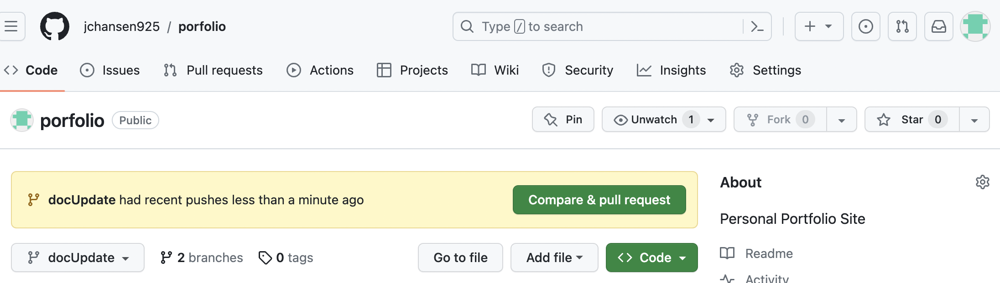
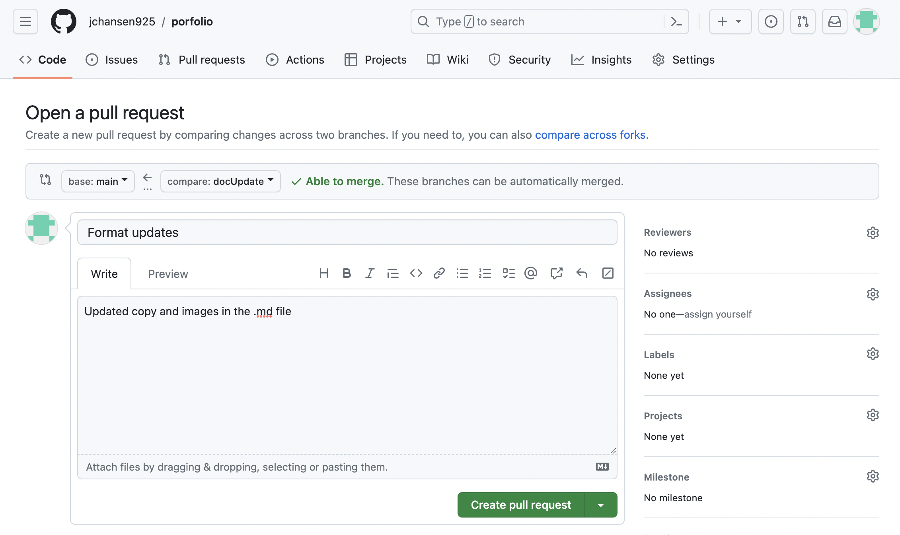
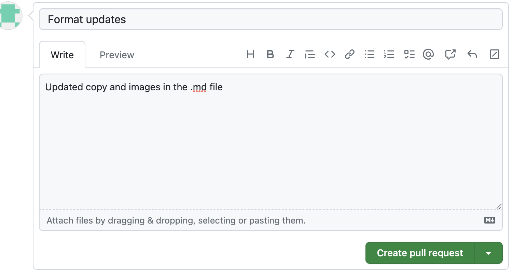

# Submitting Pull Requests

1. Once you push the changes to your branch, a **Compare & pull request** button will appear on the upper right-hand side of the page.

    

1. Select the **Compare & pull request** button, and you will be taken to a screen with the **Open a pull request** heading.

     

1. In the title bar, you can give your pull request a name. 
    In the text area below the title, you can add a description of what is in the pull request. Note that a title is required and you cannot select the **Create a pull request** button without giving the pull request a title.

1. Next, open the new pull request by selecting the green **Create a pull request** button. 

     

1. Selecting the **Create a pull request** button takes you to a pull request overview page.
    On the pull request overview page, you can view your pull request status. In most cases, your pull request must be reviewed by at least one designated person before it can be merged. The pull request can be accepted and merged into the main branch by the reviewer, or it will be rejected. If the pull request is rejected, the reason given will be shown on the results page. Make the requested changes, then resubmit your pull request.

     

